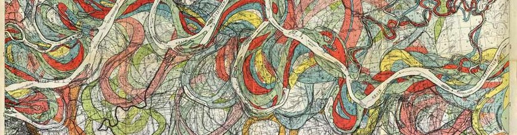
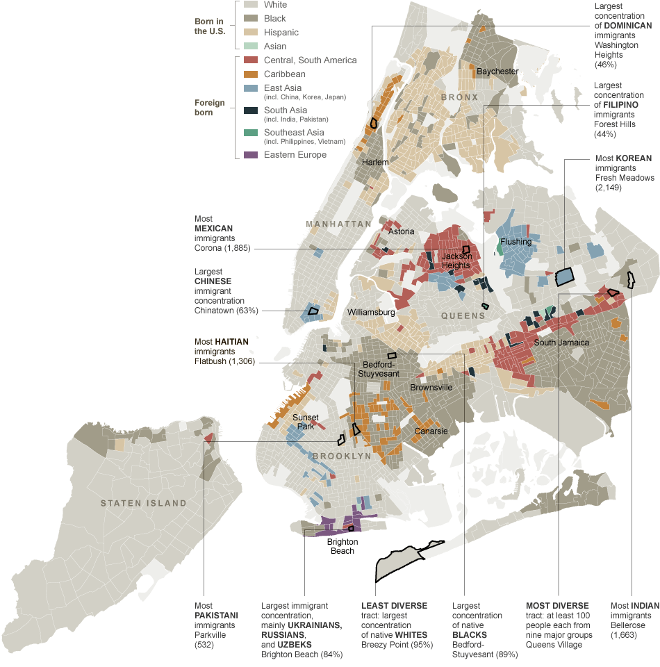
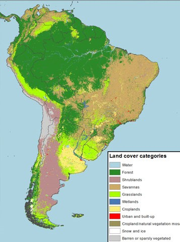
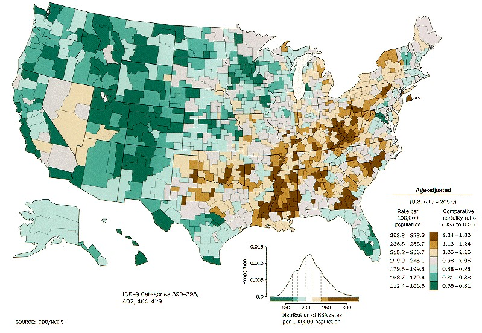
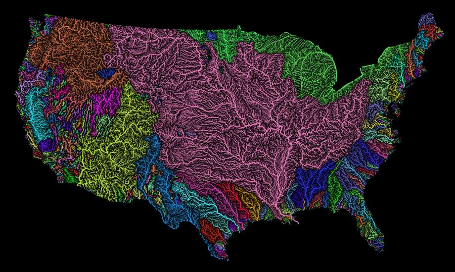

<!DOCTYPE html>
<html>
<head>
    <link rel="stylesheet" type="text/css" href="css/styl.css">
    <link href="https://fonts.googleapis.com/css?family=Raleway|Roboto+Condensed" rel="stylesheet">
    <title>Color in Mapping</title>

    > Spring 2017 | Geography 472/572 | Geovisualization: Geovisual Analytics
    >
    > Presenter: Madeleine Savage
    >
    > April 27, 2017
</head>
<body>

<h1>USING COLOR IN MAPPING </h1>

    

<h2>Why is Color Important </h2>

    
Color is an extremely important component to map making, as it is an element which instantly communicates a theme or idea to an audience.
    Decision in color are vital in making a map that is visually pleasing, elegant, clear, and professional. 

 

<h2>Color Fundamentals </h2>

 Hue, Saturation, and Lightness (value)

 

<h2>Lightness </h2>

 The lightness, or value, of a color is how light or dark a color is. Using different lightness
    values of the same hue is the best way to display quantitative data, or to shows a sequential
    pattern. Usually in this type of mapping, light colors are usually associated with low data
    values, dark colors with high data values.

<figure>
    
    <figcaption>Fig1. Notice how the blue in the lake goes from light to dark- dark symbolizing deep water, and light symbolizing
        shallow water.</figcaption>
</figure>

 

<h2>Hue </h2>

 Hue is the perceptual dimension of color we associate with color names. In mapping, different
    hues are used to display different feature types, and to show qualitative data. Assorted colors
    represent different kinds of map features or categories that are not ordered. When using hues
    to help distinguish features, it is important to choose ones that one can easily tell apart
    from the other when right next to each other. 

<figure>
    
    <figcaption>Fig 2. This is a choropleth map of New York City which shows the distribution of different ethnicities
        symbolized by different hues.</figcaption>
</figure>

 

<h2>Saturation </h2>

 Saturation basically describes a colors distance from gray, or the vividness of the color.
    Colors that have a high saturation are more vivid and bright, less saturated color are closer
    to gray. Saturation doesn’t have its own explicit use like lightness and hue, but rather it
    is used to reinforce lightness change to help distinguish map symbols or to make colors more
    subdued.

<figure>
    
    <figcaption>Fig 3. This map shows how saturation can be used to highlight smaller areas which can be otherwise lost in a map.
        For example, the Urban areas are depicted in a more saturated, bright color compared to the rest of the map in order for it be seen.</figcaption>
</figure>
 

<h2>Divergent Colors</h2>

 Divergent color schemes utilize both hue and lightness to display data, specifically when there
    is a midpoint and two opposite extremes 

<figure>
    
    <figcaption>Fig 4. This choropleth map has a divergent color scheme, where it used two hues (green and brown) and varying
        values of those colors.</figcaption>
</figure>
 

<h2>Choosing the right colors  </h2>

 As a rule of thumb, it is good to make natural features their natural color, although there are
    many exceptions. It is also important to use colors that fit the theme of your map, for examples
    properly using cool or warm colors to highlight a theme. 

<figure>
    
    <figcaption>Fig 5. This map shows different river basins in the US, using different saturated hues to tell apart the different basins. </figcaption>
</figure>

 

<h3>Resources</h3>
<p2>Brewer, Cynthia A. Designing Better Maps : A Guide for GIS Users. Second ed. Redlands, California: Esri, 2016. Print.</p2>
 
<p2>http://wiki.gis.com/wiki/index.php/Color</p2>
 
<p2>workingwithcolor.com</p2>
 
<p2>images.google.com</p2>

</body>
</html>
